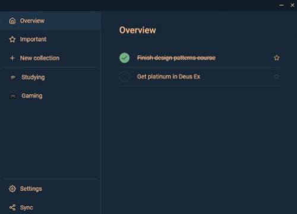

# Vue Todo Manager

A desktop application to manage and track your everyday goals

## Features

- Сustomizable to-do collections
- Variety of color themes
- LocalStorage state persistence
- WebRTC synchronization of app state

## Used stack

- Vue 3 (Composition API)
- Vite
- Vue Router
- Pinia
- PeerJS
- Electron
- Punycode

## Showcase

  
Theme switching

  

  
Collection customization

  

  
WebRTC synchronization

  

